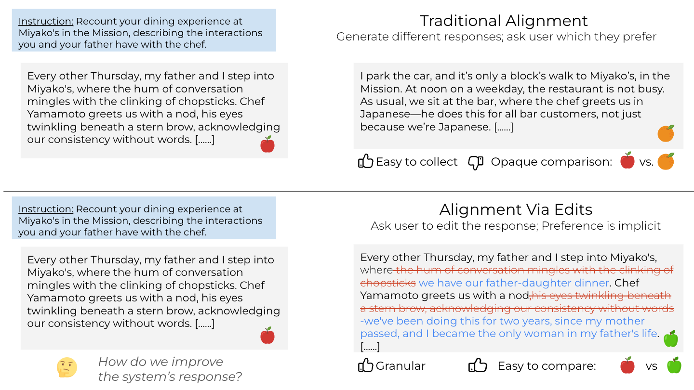

# Idiosyncrasies in LLM writing

Code repository for the paper `Can AI writing be salvaged? Mitigating Idiosyncrasies and Improving Human-AI Alignment in the Writing Process through Edits`

<p align="center" style="width: 750px;">
  
</p>

## 1. Data Release

In this repository, we release (1) The LAMP corpus 1057 instruction,response pair with finegrained_edits, (2) 50 samples that are reannoted by 3 writers, (3) the 600 preference annotations we collected on to judge alignment:

<p align="center">
  <a href="https://www.youtube.com/watch?v=NQtyE4tCp5k" target="_blank">
    
  </a>
</p>

- The LAMP folder contains LAMP.json and a reannotation folder. The schema for each sample in the LAMP.json file is as follows. The fields are self explanatory. 'preedit' is the LLM generated paragraph before any edit while 'preedit' is after edit. The finegrained edits at span level are inside 'fine_grained_edits'. We cannot distribute the NewYorker Paragraph from which the instruction was created. 
  
    ```
        {
        "instruction": "What happens when she goes outside to smoke a menthol cigarette and starts thinking about Shirley?",
        "preedit": "She steps out into the crisp evening air, [......]",
        "postedit": "The first drag fills her lungs, [.....]",
        "id": "W1_batch1",
        "source": "claude3.5-sonnet",
        "type": "Literary Fiction",
        "fine_grained_edits": [
                        {
                            "originalText": "She steps out into the crisp evening air, cigarette in hand.",
                            "editedText": "",
                            "categorization": "Unnecessary/Redundant Exposition"
                        },
                        {
                            "originalText": "damp chill.",
                            "editedText": "damp evening chill, or maybe it's just the menthols.",
                            "categorization": "Lack of Specificity and Detail"
                        },
                        {
                            "originalText": "like they always seem to lately",
                            "editedText": "as they often have in these difficult months",
                            "categorization": "Awkward Word Choice and Phrasing"
                        },
                        {
                            "originalText": "as",
                            "editedText": "and",
                            "categorization": "Awkward Word Choice and Phrasing"
                        },
                        {
                            "originalText": "But the good memories are fleeting, replaced by their last fight",
                            "editedText": "Yet again, the good memories subsumed the wound of their last fight",
                            "categorization": "Poor Sentence Structure"
                        },
                        {
                            "originalText": "biting",
                            "editedText": "vicious",
                            "categorization": "Awkward Word Choice and Phrasing"
                        },
                        {
                            "originalText": "She",
                            "editedText": "Through the dense, pungent smoke, she",
                            "categorization": "Lack of Specificity and Detail"
                        },
                        {
                            "originalText": "now. She stubs it out and",
                            "editedText": "and",
                            "categorization": "Unnecessary/Redundant Exposition"
                        },
                        {
                            "originalText": "cigarette",
                            "editedText": "stub",
                            "categorization": "Awkward Word Choice and Phrasing"
                        }
                ],
        "url": "https://www.newyorker.com/magazine/2012/12/24/shirley-temple-three",
        "creativity_scores": [
            "3",
            "5"
        ],
        "split": "test",
    },
  ```
    
- The preference_ranking folder has the 7 batches and the respective annotator file and their preference ranking.
- The preference_ranking/agreement_map.json has all the annotations for preference ranking consolidated where {'Human-edited': 1, 'AI-generated': 2, 'AI-edited': 3}
- To calculate the IAA with Kendall Tau look at preference_ranking/calc_kendall_tau.py
- To understand at our `LLM_edited_oracle' and LLM_edited_full set up look at the files LLM_edited_oracle.json and LLM_edited_full.json

The [Data_Inspection.ipynb](https://github.com/salesforce/creativity_eval/blob/main/Writing_Alignment/notebooks/Data_Analysis.ipynb) notebook shows how to reproduce all the analysis in Section 5 of our data.

The [Detection_Task_Agreement](https://github.com/salesforce/creativity_eval/blob/main/Writing_Alignment/notebooks/Detection_Task_Agreement.ipynb) notebook shows how to reproduce all the results for span level precision.

The [rewriting_prompts.ipynb](https://github.com/salesforce/creativity_eval/blob/main/Writing_Alignment/notebooks/rewriting_prompts.ipynb) notebook shows how to get rewrites for a span by loading the prompts/rewrite_prompts_fewshot25.json. It is shown for GPT4o but you can try with any model

If you are curious about the syntactic idiosyncrasies look at the respective folder 

## 2. Citing work

If you use this code or data please cite
```
  @article{chakrabarty2024can,
    title={Can AI writing be salvaged? Mitigating Idiosyncrasies and Improving Human-AI Alignment in the Writing Process through Edits},
    author={Chakrabarty, Tuhin and Laban, Philippe and Wu, Chien-Sheng},
    journal={arXiv preprint arXiv:2409.14509},
    year={2024}
  }
```
